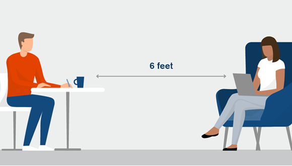
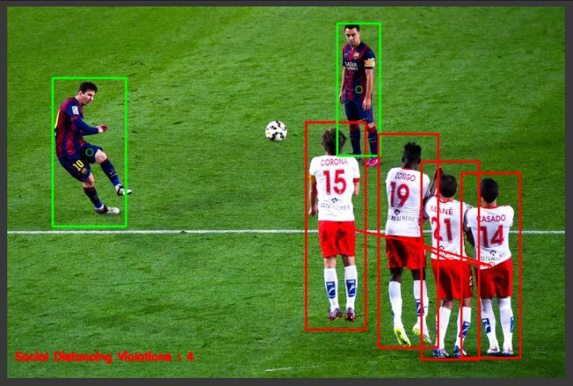

# Social-Distancing-Detection-using-Object-Detection

 

## Business Objectives :

In the fight against the Covid-19 pandemic, social distancing, contactless meetings, wearing mask all are proven to be very effective measure to slow down the spread of the virus. social distancing is the one of the best way to prevent from virus. people asked to keep distance of at least 6 feetform other to stop the spread of a virus.

Social distancing, also called physical distancing, is a measures intended to prevent the spread of a contagious disease by maintaining a physical distance between people.

In this project, the objecctive is to build an Object Detection System to detect persons and calculate the distance between them and detect social distance violations.

## Data Collection :

The data was taken from google for testing.

We would be using the available libraries like OpenCV and pre-trained Object Detection model like YOLO v3.

## Modelling :

The following modelling approach was used in the project:

1. Load the COCO dataset pre-trained YOLO v3 weights
2. Detect Person in the image
3. Calculate the distance between every detected persons
4. Mark the detections

The detailed analysis and model creation can be found in the .ipynb file. 

## Results :

Some of the test images are given below.

## Conclusions :

We were able to build a Social Distancing System using OpenCV and YoLo v3 model. Even though it works fairly well, a lot of space is available for improvement. The fps is fairly low in this project but we can increase it using other SOTA techniques.

### Future Scope :

Although this project is cool, it has a few limitations,
  - This project does not take into account the camera perspective.
  - It does not leverage a proper camera calibration (Distances are not measure accurate).
  - We can use other SOTA models like SSD, SSDLite to get better fps rendering.
